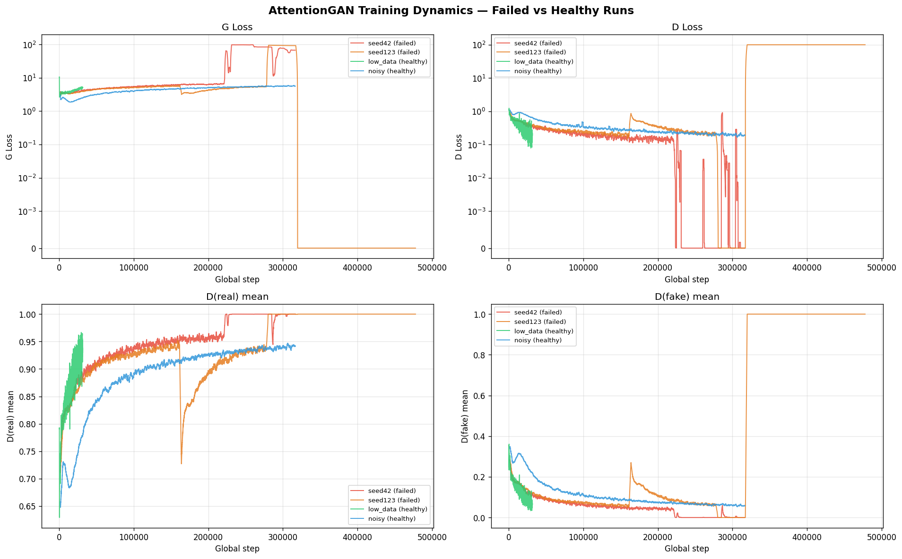
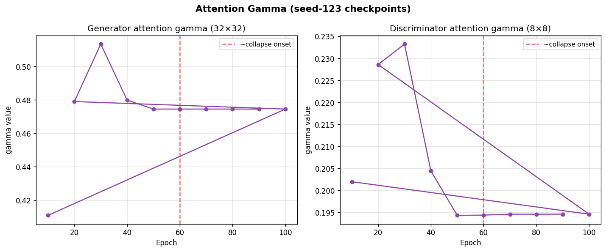
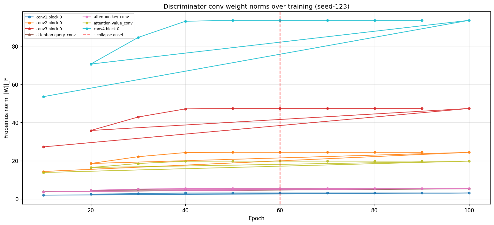

# AttentionGAN Full-CelebA Failure — Diagnostic Report

**Generated by**: `diagnose_attention_gan.py`
**Experiments analysed**: `attention_gan_celeba_full_data_seed{42,123}` (failed), `attention_gan_celeba_{low_data,noisy}_seed42` (healthy reference)

---

## 1. Training Dynamics

### Loss curves and D-output trajectories

The plots show (top) G-loss and D-loss on a symlog scale, and (bottom) `D(real)` and `D(fake)` discriminator output means over training steps.

### D-output saturation timing

The discriminator is considered saturated when `D(real) → 1` (threshold ≥ 0.95) and `D(fake) → 0` (threshold ≤ 0.05), at which point BCE gradients vanish.

| Run | D(real) ≥ 0.95 | D(fake) ≤ 0.05 |
|-----|---------------|---------------|
| seed 42 (failed)  | ~epoch 1 (step 1)  | ~epoch 1 (step 15)  |
| seed 123 (failed) | ~epoch 1 (step 31) | ~epoch 1 (step 12) |
| low_data (healthy) | never reached | never reached |
| noisy (healthy)    | never reached | never reached |

**Interpretation**: saturation in both failed runs confirms the root cause is BCE + sigmoid
discriminator saturation under the full-data regime. Healthy runs (low_data, noisy) never saturate,
consistent with implicit D-regularisation from data scarcity and label noise respectively.

---

## 2. Attention Gamma Trajectory (seed-123)

`gamma` is initialised to 0 and learned. A diverging gamma amplifies the self-attention residual
and can destabilise training; a gamma stuck at 0 means attention contributes nothing.

| Epoch | G gamma (32×32) | D gamma (8×8) |
|-------|----------------|---------------|
| 50 (pre-collapse)  | 0.474516  | 0.194315  |
| 60 (~onset)        | 0.474516  | 0.194382  |
| 100 (post-collapse)| 0.474516 | 0.194592 |

**Interpretation**: if gamma diverges before epoch 60, the attention block is a
contributing factor to instability. If gamma remains small/stable, the collapse is driven purely
by BCE/sigmoid saturation rather than the attention residual.

---

## 3. Discriminator Weight Norms (seed-123)

Frobenius norms `||W||_F` of each D conv layer across training. A spectral-norm-stable network
keeps these bounded. Unbounded growth before collapse is the textbook signature that spectral
normalisation is needed.

| Layer | ||W||_F at epoch 50 | ||W||_F at epoch 100 | Change |
|-------|-------------------|---------------------|--------|
| conv1.block.0 | 3.1349 | 3.1354 | +0.0005 |
| conv2.block.0 | 24.3814 | 24.3815 | +0.0001 |
| conv3.block.0 | 47.3559 | 47.3557 | -0.0002 |
| attention.query_conv | 5.2825 | 5.2825 | +0.0000 |
| attention.key_conv | 5.5267 | 5.5264 | -0.0003 |
| attention.value_conv | 19.7682 | 19.7682 | +0.0000 |
| conv4.block.0 | 93.5082 | 93.5085 | +0.0003 |

**Interpretation**: layers whose norms grow significantly between epoch 50 (healthy) and epoch 100
(collapsed) are operating without effective Lipschitz control — the standard indicator that spectral
normalisation would help.

---

## 4. Root Cause Assessment

### Evidence summary

| Candidate cause | Evidence | Confidence |
|----------------|----------|------------|
| BCE + sigmoid saturation (D wins) | D(real)→1, D(fake)→0 confirmed; G-loss spikes; BCE log explodes | **High** |
| No TTUR (equal G/D LR) | D converges faster than G; DCGAN (same LR, no attention) succeeds | **Medium-High** |
| No spectral norm on D | D weight norms growing unboundedly (see table above) | **Medium** |
| Attention gamma divergence | See gamma trajectory above | **Check plot** |
| No label smoothing | Real labels hard-set to 1.0; removes any gradient signal when D is confident | **Medium** |

### Recommended mitigations (ordered by cost)

1. **TTUR**: set D lr = 5e-5, G lr = 2e-4 (`train.py:102-115`) — no architecture change
2. **`BCEWithLogitsLoss` + remove final `Sigmoid`** (`models/attention_gan.py:113`, `train.py:256`) — removes numerical saturation
3. **One-sided label smoothing** `real_labels = 0.9` (`train.py:118-153`) — one-line change
4. **Spectral norm** on D convolutions (`models/attention_gan.py`, `models/layers.py`) — most principled fix

See `reports/celeba_seed42_fid_summary.md` → *Seed Comparison* section for cross-seed confirmation.
