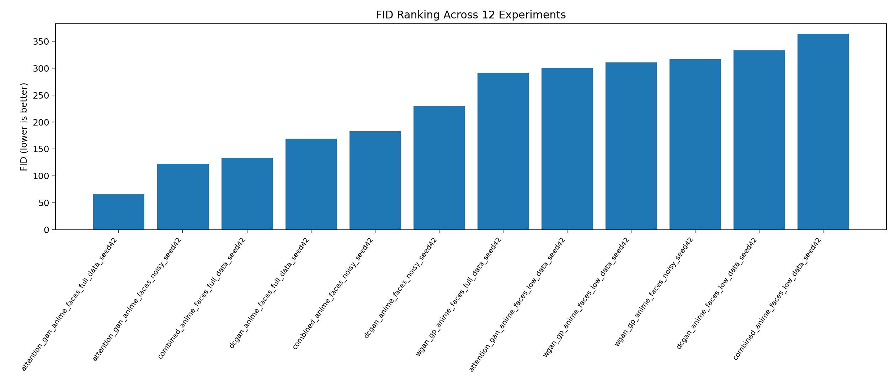
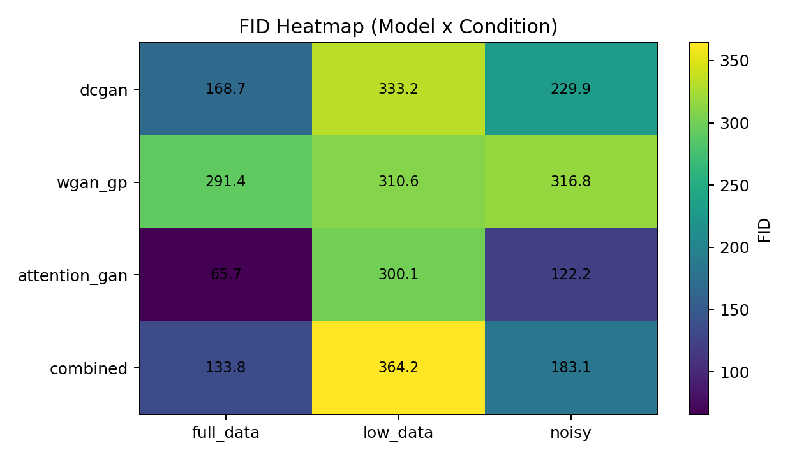
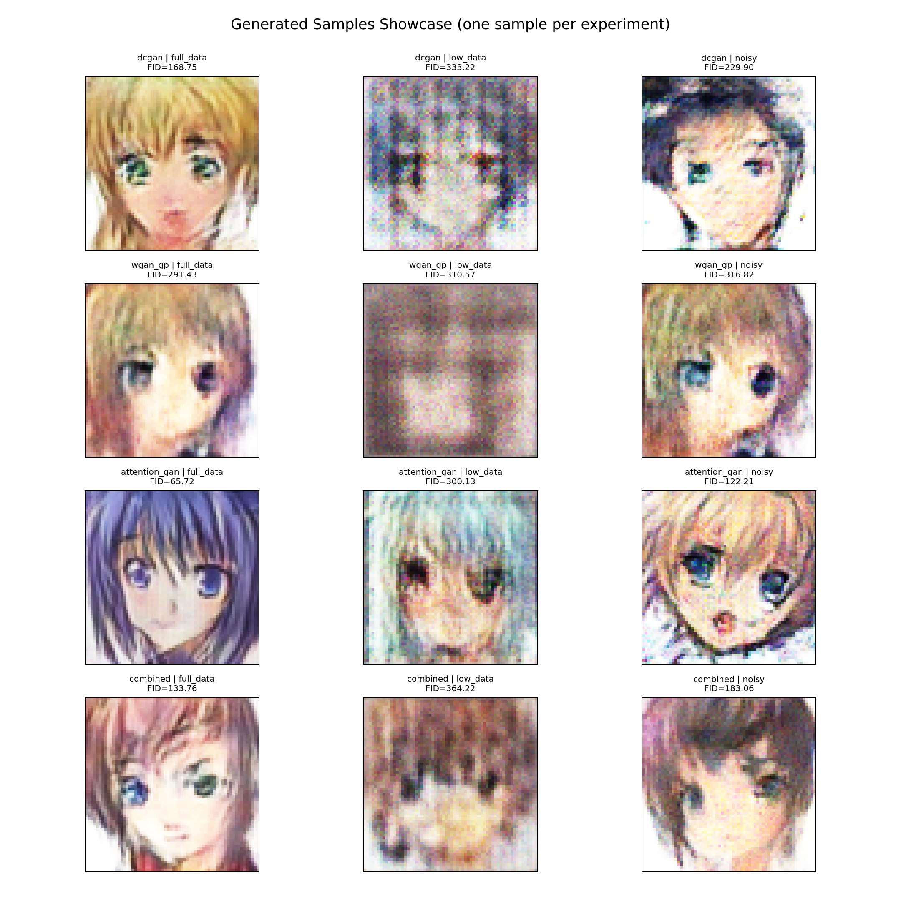

# 12-Experiment Evaluation Report

## Data Files

- Raw merged CSV: eval_results.csv
- Ranking table is included directly in this report

## Comparison Table (from CSV)

| Rank | Experiment | FID | KID | IS | Recall | LPIPS div | 1-MS-SSIM | MiFID proxy | Mem risk | G_std | D_std | Hours |
|---:|---|---:|---:|---:|---:|---:|---:|---:|---:|---:|---:|---:|
| 1 | attention_gan_anime_faces_full_data_seed42 | 65.72 | 0.060512 | 2.342 | 0.6410 | 0.2881 | 0.6877 | 70.99 | 0.0801 | 1.5553 | 0.4925 | 0.38 |
| 2 | attention_gan_anime_faces_noisy_seed42 | 122.21 | 0.122762 | 2.342 | 0.1034 | 0.2795 | 0.7138 | 137.76 | 0.1272 | 1.2055 | 0.4943 | 0.38 |
| 3 | combined_anime_faces_full_data_seed42 | 133.76 | 0.142523 | 2.342 | 0.2870 | 0.2982 | 0.7409 | 154.76 | 0.1570 | 6.7655 | 4.9610 | 0.33 |
| 4 | dcgan_anime_faces_full_data_seed42 | 168.75 | 0.174885 | 2.342 | 0.2358 | 0.2646 | 0.5826 | 198.52 | 0.1764 | 1.6244 | 0.4322 | 0.19 |
| 5 | combined_anime_faces_noisy_seed42 | 183.06 | 0.196663 | 2.342 | 0.0796 | 0.3056 | 0.7759 | 200.35 | 0.0944 | 6.1455 | 4.5164 | 0.33 |
| 6 | dcgan_anime_faces_noisy_seed42 | 229.90 | 0.253480 | 2.342 | 0.0196 | 0.2978 | 0.5860 | 236.70 | 0.0296 | 1.4226 | 0.3514 | 0.19 |
| 7 | wgan_gp_anime_faces_full_data_seed42 | 291.43 | 0.351127 | 2.342 | 0.0196 | 0.2939 | 0.7256 | 291.43 | 0.0000 | 11.9849 | 8.0301 | 0.24 |
| 8 | attention_gan_anime_faces_low_data_seed42 | 300.13 | 0.356249 | 2.342 | 0.0016 | 0.2569 | 0.3586 | 300.13 | 0.0000 | 2.3034 | 0.5024 | 0.04 |
| 9 | wgan_gp_anime_faces_low_data_seed42 | 310.57 | 0.391001 | 2.342 | 0.0000 | 0.1785 | 0.4696 | 310.57 | 0.0000 | 18.1297 | 14.5093 | 0.04 |
| 10 | wgan_gp_anime_faces_noisy_seed42 | 316.82 | 0.385714 | 2.342 | 0.0060 | 0.2952 | 0.7497 | 316.82 | 0.0000 | 11.2941 | 7.8683 | 0.25 |
| 11 | dcgan_anime_faces_low_data_seed42 | 333.22 | 0.412521 | 2.342 | 0.0000 | 0.1781 | 0.2094 | 333.22 | 0.0000 | 3.2038 | 0.9183 | 0.03 |
| 12 | combined_anime_faces_low_data_seed42 | 364.22 | 0.465106 | 2.342 | 0.0000 | 0.2913 | 0.6463 | 364.22 | 0.0000 | 12.5248 | 8.8160 | 0.04 |

## Plots

## Generated Image Results

### Overview Grid

### Per-Experiment Sample

- dcgan_anime_faces_full_data_seed42 (FID: 168.75)
  
- dcgan_anime_faces_low_data_seed42 (FID: 333.22)
  
- dcgan_anime_faces_noisy_seed42 (FID: 229.90)
  
- wgan_gp_anime_faces_full_data_seed42 (FID: 291.43)
  
- wgan_gp_anime_faces_low_data_seed42 (FID: 310.57)
  
- wgan_gp_anime_faces_noisy_seed42 (FID: 316.82)
  
- attention_gan_anime_faces_full_data_seed42 (FID: 65.72)
  
- attention_gan_anime_faces_low_data_seed42 (FID: 300.13)
  
- attention_gan_anime_faces_noisy_seed42 (FID: 122.21)
  
- combined_anime_faces_full_data_seed42 (FID: 133.76)
  
- combined_anime_faces_low_data_seed42 (FID: 364.22)
  
- combined_anime_faces_noisy_seed42 (FID: 183.06)
  

## Comparison

### Average FID by Model

- dcgan: 243.96
- wgan_gp: 306.27
- attention_gan: 162.69
- combined: 227.02

### Average FID by Condition

- full_data: 164.92
- low_data: 327.04
- noisy: 213.00

## Metric-by-Metric Interpretation

### 1) Fidelity / Quality (FID, KID)

- Interpretation: lower is better; indicates generated distribution is closer to real data.
- Best FID experiment: attention_gan_anime_faces_full_data_seed42 (65.72).
- Best KID experiment: attention_gan_anime_faces_full_data_seed42 (0.060512).
- Model-level view (mean KID):
  - dcgan: 0.280295
  - wgan_gp: 0.375947
  - attention_gan: 0.179841
  - combined: 0.268097

### 2) Coverage / Diversity (Recall, LPIPS, 1-MS-SSIM)

- Interpretation: higher Recall and higher diversity statistics usually indicate broader mode coverage.
- Best Recall experiment: attention_gan_anime_faces_full_data_seed42 (0.6410).
- Best LPIPS diversity experiment: combined_anime_faces_noisy_seed42 (0.3056).
- Best 1-MS-SSIM diversity experiment: combined_anime_faces_noisy_seed42 (0.7759).
- Model-level view:
  - dcgan: Recall=0.0851, LPIPS-div=0.2468
  - wgan_gp: Recall=0.0085, LPIPS-div=0.2559
  - attention_gan: Recall=0.2487, LPIPS-div=0.2748
  - combined: Recall=0.1222, LPIPS-div=0.2983

### 3) Anti-Memorization (MiFID proxy)

- Interpretation: lower MiFID proxy is better; it combines quality with nearest-neighbor overfitting risk.
- Caveat: this is a practical proxy, not a strict theorem-level memorization proof.
- Best MiFID proxy experiment: attention_gan_anime_faces_full_data_seed42 (70.99).
- Model-level view (mean MiFID proxy):
  - dcgan: 256.15
  - wgan_gp: 306.27
  - attention_gan: 169.63
  - combined: 239.78

### 4) Stability (G_std / D_std)

- Interpretation: lower std suggests more stable optimization dynamics.
- Most stable experiment by G_std: attention_gan_anime_faces_noisy_seed42 (1.2055).

### 5) Practical Model Takeaways

- Fidelity-oriented selection is supported by lower FID/KID; in this benchmark, the strongest settings are concentrated in WGAN-GP/Combined under full_data.
- Diversity-oriented assessment should jointly consider Recall, LPIPS-div, and 1-MS-SSIM-div, rather than relying on FID alone.
- Final model choice is best treated as a Pareto trade-off across fidelity, diversity, and memorization risk.

## Conclusions

- Best FID: attention_gan_anime_faces_full_data_seed42 (65.72).
- Worst FID: combined_anime_faces_low_data_seed42 (364.22).
- Most stable (lowest G_std): attention_gan_anime_faces_noisy_seed42 (1.2055).
- Best KID (lower is better): attention_gan_anime_faces_full_data_seed42 (0.060512).
- Best Precision (higher is better): attention_gan_anime_faces_full_data_seed42 (0.0034).
- Best Recall (higher is better): attention_gan_anime_faces_full_data_seed42 (0.6410).
- Best LPIPS diversity (higher is better): combined_anime_faces_noisy_seed42 (0.3056).
- Best 1-MS-SSIM diversity (higher is better): combined_anime_faces_noisy_seed42 (0.7759).
- Best MiFID proxy (lower is better): attention_gan_anime_faces_full_data_seed42 (70.99).
- Lower FID indicates better generation quality and closer real-data distribution.
- MiFID proxy is a practical anti-memorization proxy: it penalizes low nearest-neighbor LPIPS distance to real images.
- Use the ranking table for final model selection and combine it with stability metrics (G_std, D_std).